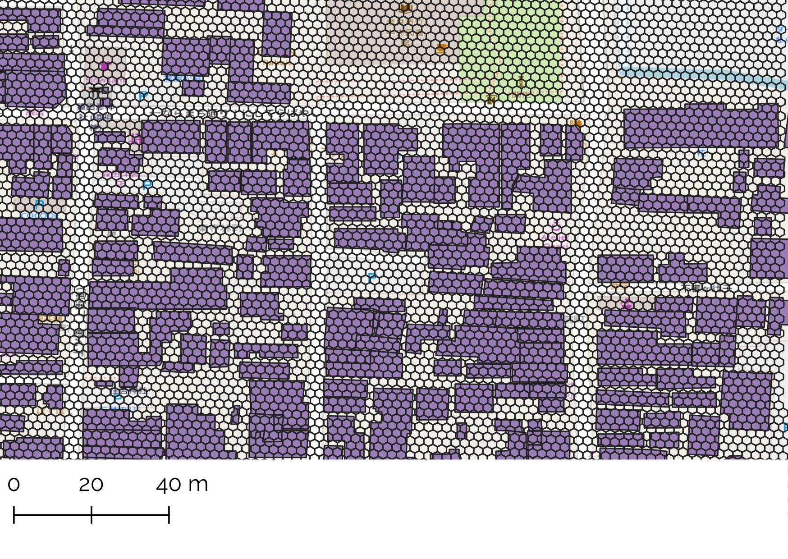

# H3グリッドによる建物IDの付与

国土交通省の地理空間情報課ラボが開催している[GeoSynergy Linkage Hub](https://www.mlit-gis-lab.jp/idea/)に投稿のためのレポジトリです。

お題5：建物へのID付番 に対して、H3を用いたIDについて提案しています。

実際の作業については、[ノートブック](H3_grid_id.ipynb)にて、奈良市中心部を対象敷地としたID付与の試行作業例を提示しています。

## アイデアの概要

**オープンソースの六角形グリッドである[H3](https://h3geo.org/)を用いて建物IDを付与する。**

解像度14のH3グリッド（1辺1.5m程度）を用いて、建物中心が所在するグリッドのIDを基にIDを付与します。

グリッドの大きさと建物サイズの比較（奈良市中心部 ならまち地区周辺） 建物サイズに対して、十分にグリッドの大きさが小さいことが確認できます。

### ID付与の手順

1. 各建物のGISデータを基に、中心点の座標を取得［例：135.81542, 34.68172］
1. 緯度・経度の情報から、H3グリッドのIDを取得［例：8e2e611a02ae6c7］
1. 桁数削減のため、2進数に変換・ユニークな部分を抽出し36進数で表記［例：105h6c9crc］

今回の奈良市中心部での試行で、6,000件を超える建築物に対しても瞬時に付与が完了します。今回はPythonを用いた作業ですが、GISやJavaScriptでもH3が使用できる限り作業可能です。

桁数削減のアイデア。メタデータなどの全レコードで共通な部分を削除するほか、16進法ではなく36進法によって表記します。

### 提案手法の利点

- 短い文字列で高精度に位置情報が定まります。本来のH3インデックスからさらに桁数削減を行ったため、10文字程度で位置情報がかなり正確に特定できます。
- オープンソースで位置情報のみをベースとしているため、誰でもいつでも生成可能
- 電話番号に類似した階層構造を持ったIDとなります。ID前半部分を用いた地域の推定や、市内であれば「市外局番」部分を省く要領で特定に必要な桁数を減少させることができます。
- 独自アルゴリズムを保持する必要がなく、メンテナンスも容易となります。
- 他のGISデータとも結合が容易です。

H3グリッドの特性を用いた集計の例。解像度10（1辺約75m）の六角形ごとに、建物数を集計した例。H3の機能を用いて空間演算を用いることなくtabularな計算のみで集計が可能です。